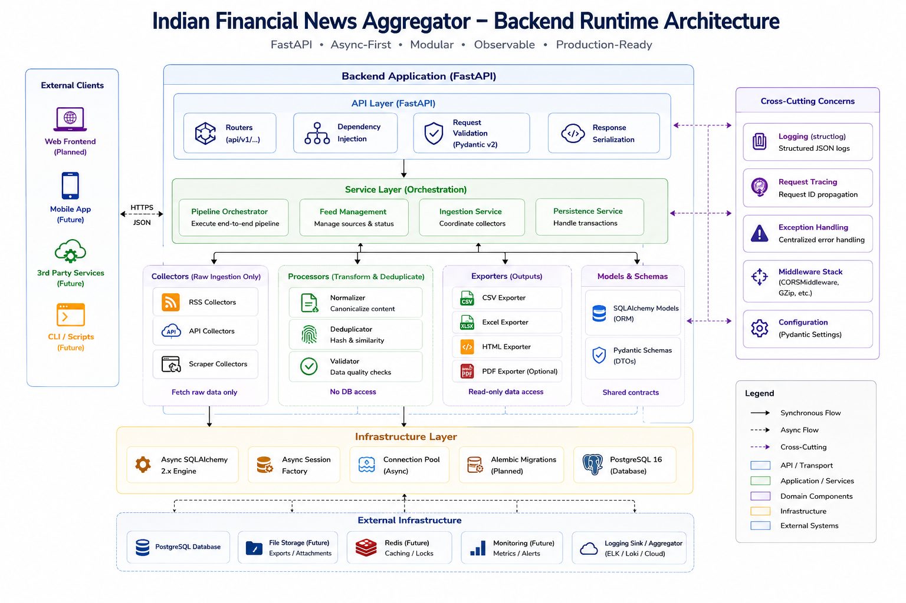
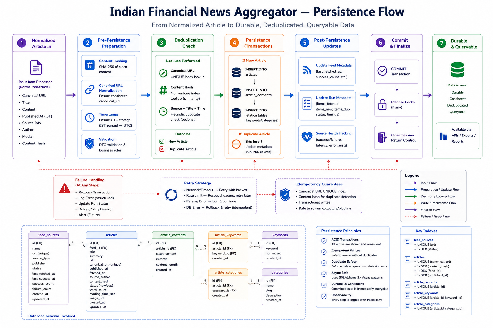

<h1 align="center">Indian Financial News Aggregator</h1>

<p align="center">
  A decoupled data ingestion platform that autonomously collects, normalizes, deduplicates, and exposes Indian financial market news.
</p>

<p align="center">
  
  
  
  
  
  
</p>

---

## Problem Statement

Financial data engineering requires strict idempotency. Market-moving information across Indian publishers (Economic Times, Moneycontrol, LiveMint, Business Standard) is volatile, schemas are inconsistent, and data duplication is rampant due to overlapping news windows. 

Synchronous scraping approaches inevitably fail because network I/O is unpredictable and parsing malformed XML in the API event loop degrades serving performance. This repository solves the aggregation problem by decoupling ingestion from serving, pushing deduplication constraints to the database engine, and utilizing a purely asynchronous execution model.

---

## What Happens On Startup?

The environment provisions autonomously via Docker Compose (`docker-compose.prod.yml`). Upon starting the containers, the following sequence executes strictly:

1. **Migrations**: `alembic upgrade head` executes synchronously to verify schema integrity.
2. **Feed Seeding**: If the `feed_sources` table is empty, validated initial RSS sources are seeded.
3. **Scheduler Startup**: `APScheduler` binds to the primary `asyncio` event loop.
4. **Ingestion Execution**: The first pipeline job triggers immediately, executing HTTP fetches concurrently.
5. **Persistence**: Parsed entities are upserted into PostgreSQL using `ON CONFLICT DO NOTHING` hashes.
6. **Analytics Refresh**: Materialized views (e.g., `hourly_trends_mv`) are refreshed concurrently.
7. **API Exposure**: The Uvicorn worker pool begins accepting HTTP requests at `localhost:8000`.

---

## System Architecture


The platform enforces rigid boundaries. Nginx routes traffic securely to the internal components. The FastAPI container acts as the monolithic execution environment for both API serving and background orchestration. PostgreSQL manages raw data persistence, full-text search indexes, and materialized analytics views.

---

## End-to-End Pipeline


Data flows unidirectionally from collection to serving:
1. **Source Collection**: Circuit-breaker-protected `httpx` async requests pull XML.
2. **Normalization**: HTML entities are stripped, datetimes are standardized, and payloads are coerced into Pydantic models.
3. **Deduplication**: A SHA-256 hash is computed from the payload's core content.
4. **Enrichment**: Configurable heuristics extract sectors and named entities.
5. **Persistence**: SQLAlchemy executes batched, async transactions.
6. **Analytics**: Post-ingestion hooks trigger concurrent materialized view refreshes.
7. **Export**: The API streams data via server-side cursors to prevent memory exhaustion.

---

## Runtime Architecture



---

## Persistence & Deduplication



## Core Engineering Capabilities

| Capability | Implementation Mechanism |
| :---: | :---: |
| **Asynchronous Orchestration** | Non-blocking `AsyncIOScheduler` executing alongside the Uvicorn worker pool. |
| **Idempotent Storage** | Cryptographic content hashing combined with PostgreSQL `UPSERT` constraints. |
| **Flat API Latency** | Zero-offset keyset pagination ensuring $O(1)$ database seek times. |
| **Precomputed Analytics** | PostgreSQL Materialized Views refreshed concurrently in the background. |
| **Full-Text Search** | Native PostgreSQL `tsvector` and GIN indexing. |
| **Streaming Export** | FastAPI `StreamingResponse` utilizing database cursors for unbounded CSV generation. |

---

## Operational Characteristics

The system is currently operating in a stable state with the following verifiable behaviors:
- **Resilience**: A malformed RSS feed fails locally and updates pipeline telemetry; it does not crash the orchestration thread or the API worker.
- **Deduplication Validation**: During simulated overlapping fetch windows, the database rejects exactly 100% of redundant hashes without executing read queries.
- **Resource Bounding**: The `StreamingResponse` export mechanism caps API memory usage regardless of whether 1,000 or 1,000,000 rows are requested.

---

## Repository Structure

```text
indian-financial-news-aggregator/
├── backend/                  # Monolithic Python data engine
│   ├── migrations/           # Alembic revision history
│   ├── src/app/              # Core domain, routing, and persistence logic
│   ├── tests/                # Validation suites
│   ├── Dockerfile
│   └── pyproject.toml
├── frontend/                 # Temporary operational validation dashboard
├── infra/                    # Proxy and network routing
├── docs/                     # Architectural documents and audit records
└── docker-compose.prod.yml   # Production deployment manifest
```

---

## Quick Start

### Docker Deployment

To execute the fully automated ingestion and serving platform:

```bash
git clone https://github.com/Shuchi-Anush/indian-financial-news-aggregator.git
cd indian-financial-news-aggregator

cp .env.example .env

docker compose -f docker-compose.prod.yml up -d --build
```
*The API is exposed at `localhost:8000`, the metrics at `localhost:8000/metrics`, and the Streamlit operational dashboard at `localhost`.*

---

### Accessing the Dashboard

After the containers are running, you can view the live operational dashboard by opening the following URL in your web browser:

➡️ **http://localhost:80**

---

### Local Development

For backend engineers testing ingestion logic directly:

```bash
cd backend
uv sync
alembic upgrade head
uv run uvicorn app.main:app --reload
```

---

## Validation & Audit Trail

Engineering claims are validated by operational audits located in the `docs/validation/` directory:

- [Reproducibility Validation](docs/validation/reproducibility_audit.md): Verification of the zero-touch bootstrap flow.
- [Ingestion Audit](docs/validation/final_ingestion_audit_report.md): Verification of idempotency, hash generation, and error handling.
- [Contract Audit](docs/validation/frontend_backend_contract_audit.md): API endpoint integrity checks.

---

## Roadmap

**Current State (v1.3.0-demo-validated)**: The backend data ingestion architecture is structurally complete. Deduplication, persistence, and analytics generation are stable. Streamlit is active as a validation layer.

**Near-Term**: 
1. **Decoupled Orchestration**: Extracting `APScheduler` jobs into a distributed Celery/Redis queue to allow horizontal scaling of the ingestion tier.
2. **Next.js Presentation Layer**: Replacing the Streamlit dashboard with a statically generated React application.

**Long-Term**: 
1. **ML Inference Pipeline**: Integrating asynchronous Named Entity Recognition (NER) models for automated entity tagging.
2. **WebSockets Syndication**: Streaming live feed updates directly to downstream consumers.

---

## Documentation Index

- [Backend Engineering Handbook](backend/README.md)
- [Frontend Architecture Roadmap](frontend/README.md)
- [System Design Document](docs/README_ARCHITECTURE.md)

---

## License

MIT License. See [LICENSE](LICENSE) for details.
