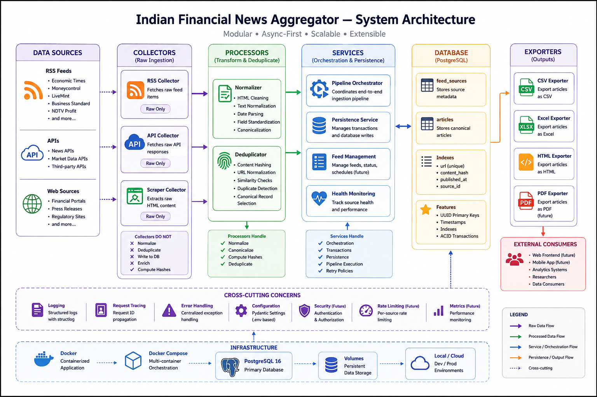
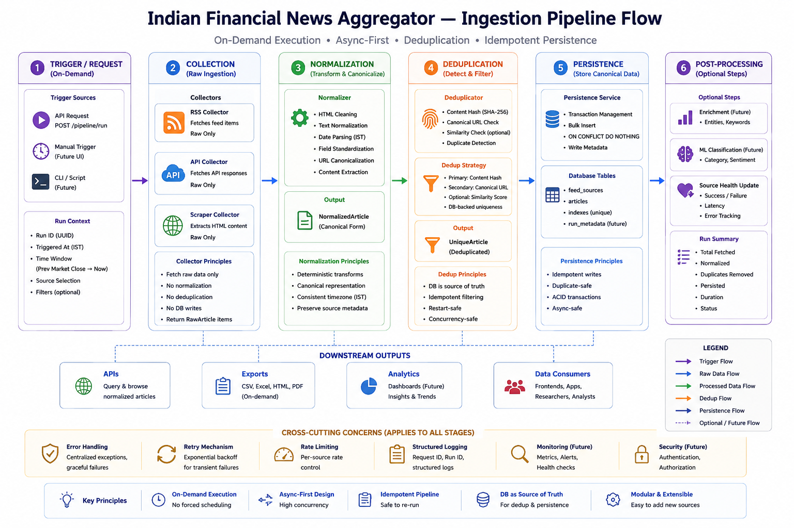
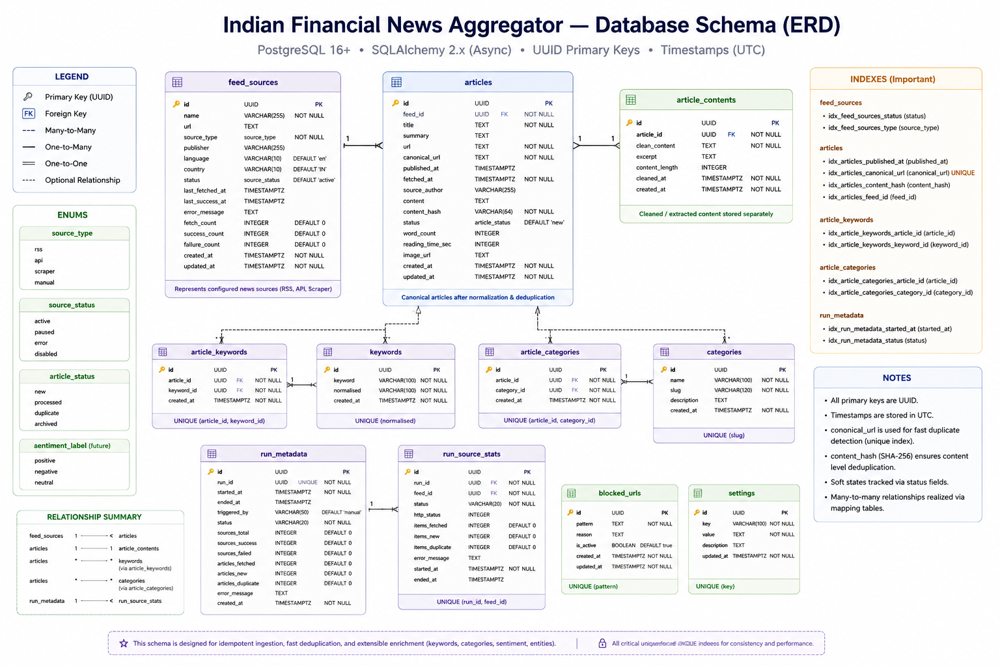

<p align="center">
  
</p>

<h1 align="center">Indian Financial News Aggregator</h1>

<p align="center">
  A production-minded async backend platform for ingesting, normalizing, deduplicating,<br/>
  persisting, and exporting Indian financial news across heterogeneous sources.
</p>

<p align="center">
  
  
  
  
  
  
  
  
  
</p>

---

## Current Phase

> **Ingestion Architecture Stabilization**
>
> Establishing strict collector → processor → service → persistence contracts before implementing production-grade source collectors. The current focus is correctness of boundaries, async-safety of persistence, and idempotency of the ingestion pipeline — not feature volume.

---

## Why This Project Exists

Most news aggregation systems are glorified scrapers with a database bolted on. This project takes the opposite approach: engineering a reliable, extensible backend ingestion platform first, with display and enrichment as downstream concerns.

The core engineering problems being solved:

- Handling **heterogeneous raw payloads** from incompatible financial sources
- Applying **canonical normalization** with deterministic output
- Preventing **duplicate persistence** across overlapping source windows
- Supporting **future ML enrichment** without schema redesign
- Maintaining **operational correctness** under restart and re-ingestion scenarios

---

## Key Capabilities

| Capability | Status |
| --- | --- |
| Async FastAPI runtime | ✅ Stable |
| Structured logging with request tracing | ✅ Stable |
| Centralized exception handling | ✅ Stable |
| Async PostgreSQL lifecycle (SQLAlchemy 2.x) | ✅ Stable |
| UUID-based ORM persistence layer | ✅ Stable |
| FeedSource + Article models | ✅ Stable |
| Typed Pydantic v2 schemas | ✅ Stable |
| Docker Compose environment | ✅ Stable |
| OpenAPI documentation | ✅ Stable |
| Collector contract layer | 🔄 In Progress |
| Normalization pipeline | 🔄 In Progress |
| Deduplication processor | 🔄 In Progress |
| Orchestration service | 🔄 In Progress |
| RSS collectors | 📋 Planned |
| Export pipeline (CSV / XLSX / HTML) | 📋 Planned |
| Alembic migrations | 📋 Planned |

---

## System Architecture

<p align="center">
  
</p>

---

## Ingestion Pipeline

<p align="center">
  
</p>

---

## Database Schema

<p align="center">
  
</p>

---

## Architecture Philosophy

The system enforces strict layered boundaries. Each layer has a single, well-defined responsibility. Cross-layer concerns are explicitly prohibited.

### Layer Responsibilities

| Layer | Responsibility | Hard Constraints |
| --- | --- | --- |
| `api/` | HTTP transport, routing, response serialization | No business logic. No DB access. |
| `collectors/` | Raw external data fetching only | No normalization. No persistence. No hashing. |
| `processors/` | Normalization, deduplication prep, canonical transforms | No external I/O. No DB writes. |
| `services/` | Orchestration, transaction boundaries, pipeline execution | No transport logic. No raw source I/O. |
| `exporters/` | Output generation (CSV, XLSX, HTML) | No business logic. No DB mutations. |
| `models/` | SQLAlchemy ORM entities | No business methods. |
| `schemas/` | Pydantic DTOs and validation contracts | No ORM references. |
| `db/` | Engine, session factory, declarative base | No application logic. |
| `core/` | Config, logging, middleware, startup lifecycle | No domain logic. |

### Collector Contract — Non-Negotiable

Collectors **must never**:

- Normalize or clean content
- Compute deduplication hashes
- Write to or read from the database
- Enrich or classify articles
- Perform any side effects beyond fetching

Collectors **must always**:

- Return raw, unmodified source payloads
- Be stateless and retry-safe
- Operate independently of orchestration state

---

## Design Goals

The system is intentionally engineered around:

- **Explicit orchestration boundaries** — no hidden pipeline magic
- **Idempotent persistence** — safe to re-ingest without creating duplicates
- **Async-safe execution** — no blocking calls in the async stack
- **Restart-safe ingestion** — re-runs produce consistent state
- **Deterministic normalization** — same input always produces same canonical output
- **Horizontal extensibility** — new sources add collectors, not rewrites

---

## Repository Structure

```text
indian-financial-news-aggregator/
│
├── backend/                        # FastAPI async backend
│   ├── src/app/
│   │   ├── api/                    # HTTP transport layer
│   │   │   └── routes/
│   │   ├── collectors/             # Raw external ingestion
│   │   │   ├── rss/
│   │   │   ├── apis/
│   │   │   └── scrapers/
│   │   ├── processors/             # Normalization + deduplication
│   │   ├── services/               # Business orchestration
│   │   ├── exporters/              # Output generation
│   │   ├── models/                 # SQLAlchemy ORM entities
│   │   ├── schemas/                # Pydantic DTOs
│   │   ├── db/                     # Engine / session / base
│   │   ├── core/                   # Config / logging / middleware
│   │   └── main.py                 # Application composition root
│   │
│   ├── tests/
│   ├── scripts/
│   ├── Dockerfile
│   └── pyproject.toml
│
├── docs/
│   ├── architecture/               # Architecture decision records
│   ├── api/                        # API contracts
│   ├── decisions/                  # ADRs
│   ├── operations/                 # Runbooks
│   └── context/                    # Engineering context
│
├── frontend/                       # Future frontend workspace
├── infra/                          # Infrastructure configuration
├── .agy/                           # Workspace state
├── .claude/                        # AI operating context
├── .github/workflows/              # CI pipelines
├── docker-compose.yml
├── .env.example
└── README.md
```

---

## Technology Stack

### Backend

| Component | Technology |
| --- | --- |
| Framework | FastAPI |
| ORM | SQLAlchemy 2.x async |
| Validation | Pydantic v2 |
| Database | PostgreSQL 16 |
| Logging | structlog |
| HTTP Client | httpx |
| RSS Parsing | feedparser |
| Package Manager | uv |

### Infrastructure

| Component | Technology |
| --- | --- |
| Containerization | Docker |
| Local Orchestration | Docker Compose |

---

## Quick Start

### 1. Clone

```bash
git clone https://github.com/Shuchi-Anush/indian-financial-news-aggregator.git
cd indian-financial-news-aggregator
```

### 2. Configure Environment

```bash
cp .env.example .env
```

### 3. Start Full Stack

```bash
docker compose up --build
```

### 4. Verify Health

```bash
curl http://127.0.0.1:8000/health
```

```json
{ "status": "ok" }
```

### 5. API Documentation

```text
http://127.0.0.1:8000/docs
```

---

## Local Development (Without Docker)

```bash
cd backend

uv sync

uv run uvicorn app.main:app \
  --app-dir src \
  --reload \
  --host 127.0.0.1 \
  --port 8000
```

---

## Operational Principles

The backend is designed to be:

| Principle | Meaning |
| --- | --- |
| **Idempotent** | Re-ingesting the same source window does not create duplicates |
| **Async-safe** | No synchronous DB access anywhere in the async stack |
| **Restart-safe** | System can be stopped and restarted without corrupting state |
| **Duplicate-resistant** | Hash-based deduplication prevents redundant article persistence |
| **Transaction-aware** | Explicit transaction boundaries; no implicit commit assumptions |
| **Horizontally extensible** | New sources require new collectors only — no core changes |

---

## Roadmap

### Near-Term

- [ ] Finalize `RawArticle` ingestion contract
- [ ] Implement RSS collector base abstraction
- [ ] Implement normalization pipeline
- [ ] Implement deduplication processor
- [ ] Implement pipeline orchestration service
- [ ] Integrate first Indian financial RSS sources
- [ ] Implement export pipeline (CSV / XLSX / HTML)
- [ ] Replace `create_all()` with Alembic migrations

### Future Phases

- [ ] Scheduling support (APScheduler or Celery)
- [ ] Source health monitoring
- [ ] ML enrichment hooks (classification, sentiment)
- [ ] Frontend dashboard
- [ ] Distributed ingestion support

---

## Current Non-Goals

The following are explicitly out of scope for the current phase:

- Authentication and authorization systems
- Celery, Kafka, or Redis infrastructure
- Distributed scheduling
- WebSocket infrastructure
- ML inference pipelines
- Frontend business logic

These will be introduced only after ingestion architecture reaches production stability.

---

## Documentation

| Area | Path |
| --- | --- |
| System Architecture | `docs/architecture/system_architecture.md` |
| Database Design | `docs/architecture/db_design.md` |
| Pipeline Flow | `docs/architecture/pipeline_flow.md` |
| Collector Strategy | `docs/architecture/collector_strategy.md` |
| API Contracts | `docs/api/api_contracts.md` |
| Architecture Decisions | `docs/decisions/` |
| Operations Runbooks | `docs/operations/` |
| Engineering Context | `docs/context/` |
| AI Operating Context | `.claude/` |

---

## Engineering Governance

The repository enforces:

- **Architecture rules** — enforced per-layer boundary constraints
- **Implementation standards** — coding conventions and async correctness patterns
- **Anti-pattern documentation** — explicitly documented failure modes to avoid
- **ADRs** — recorded rationale for all significant architectural decisions
- **AI collaboration context** — operating guidelines for AI-assisted development sessions

Governance documentation lives in `docs/decisions/` and `.claude/`.

---

## Development Philosophy

This repository deliberately prioritizes:

- **Correctness** over delivery speed
- **Maintainability** over clever shortcuts
- **Architectural stability** over premature feature surface
- **Explicit contracts** over implicit framework magic

Development proceeds in stable vertical slices. No layer is considered done until its boundaries are enforced and its async guarantees are verified.

---

## License

MIT License — see [LICENSE](LICENSE)

---

<p align="center">
  Built with production-minded backend engineering principles.
</p>
