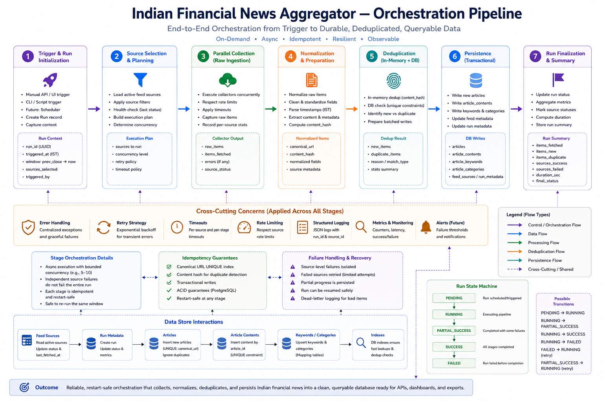

# Backend Engineering Handbook

This document serves as the comprehensive internal technical reference for the Indian Financial News Aggregator backend. It is written for backend engineers, systems architects, and open-source contributors tasked with operating, maintaining, or modifying the ingestion platform. 

This handbook covers architectural boundaries, execution models, failure scenarios, and the explicit engineering tradeoffs embedded within the core data platform.

---

## Backend Architecture

The backend is an asynchronous Python service built on FastAPI and SQLAlchemy 2.x. Unlike standard REST API wrappers over a database, this backend is engineered primarily as a heavy-duty data ingestion and aggregation engine. It manages volatile external network I/O, executes deterministic data deduplication, enforces strict transactional persistence boundaries, and exposes analytical payloads.

The architecture enforces strict topological layering to decouple HTTP transport from business domain logic.

### Module Boundaries

The repository is structured into distinct packages, each with rigid responsibilities and unidirectional dependency rules.

#### `api`
The `api` package acts exclusively as the HTTP transport layer. It contains FastAPI routers, dependency injections for database sessions, and payload serialization.
- **Responsibilities**: Route definition, HTTP status code mapping, CORS handling, and Pydantic validation of inbound requests.
- **Dependency Rules**: The `api` package may import from `services`, `schemas`, and `core`. It must **never** import directly from `models` or `repositories`, nor construct raw SQL queries.

#### `core`
The `core` package houses application-wide configuration and lifecycle management.
- **Responsibilities**: Environment variable parsing (via `pydantic-settings`), logging configuration (`structlog`), telemetry setup, and the FastAPI `@asynccontextmanager` lifespan event.
- **Dependency Rules**: `core` acts as the root. It should not depend on `services` or `api`.

#### `db`
The `db` package encapsulates the SQLAlchemy 2.x async engine, session makers, and connection pooling configurations.
- **Responsibilities**: Managing `AsyncEngine`, configuring connection limits, enabling `pool_pre_ping` for resiliency, and providing the declarative base for ORM models.
- **Dependency Rules**: Depends only on `core.config`.

#### `models`
The `models` package contains the canonical SQLAlchemy ORM definitions.
- **Responsibilities**: Mapping Python classes to PostgreSQL tables, defining relationships, and explicitly declaring constraints (e.g., `UniqueConstraint(content_hash)`).
- **Dependency Rules**: Models must remain pure data definitions. They must not contain business logic or import from `services`.

#### `repositories`
The `repositories` package implements the Repository Pattern to abstract SQLAlchemy completely from the rest of the application.
- **Responsibilities**: Executing `select`, `insert`, and `update` statements. Handling keyset pagination logic, and executing PostgreSQL-specific commands like `ON CONFLICT DO NOTHING`.
- **Dependency Rules**: Repositories import `models` and `db`. They must not know about `api` or `schemas` concepts.

#### `services`
The `services` package is the transaction coordinator and domain logic hub.
- **Responsibilities**: Orchestrating the flow of data. For example, `PipelineOrchestrationService` fetches data from collectors, maps it, and passes it to the repository within an `async with session.begin()` block.
- **Dependency Rules**: Services import `repositories`, `collectors`, and `schemas`. This is where all business logic resides.

#### `orchestration`
The `orchestration` package contains the `APScheduler` integration.
- **Responsibilities**: Defining background jobs, setting up `AsyncIOScheduler`, and triggering service layer methods on cron or interval schedules.
- **Dependency Rules**: Depends on `services` and `core`.

#### `collectors`
The `collectors` package abstracts external network I/O.
- **Responsibilities**: Executing HTTP requests to RSS publishers, parsing XML payloads via `feedparser`, and translating volatile external schemas into internal representations.
- **Dependency Rules**: Depends only on external libraries (`httpx`, `feedparser`) and internal `schemas`.

#### `schemas`
The `schemas` package defines Pydantic v2 models.
- **Responsibilities**: Validating data entering the system (from external APIs or collectors) and defining the JSON structure of data exiting the system via the `api`.
- **Dependency Rules**: Schemas are pure data transfer objects (DTOs). They have no dependencies on `models` or `db`.

---

## Runtime Lifecycle


The application initializes its global state through an asynchronous lifespan context attached to the FastAPI application. This ensures that resources are allocated safely before any HTTP requests are accepted, and cleaned up cleanly upon termination.

### Startup Sequence

1. **Container Boot**: The Docker container starts, executing `entrypoint.sh`.
2. **Database Wait**: A blocking script ensures the PostgreSQL socket is reachable, preventing immediate crash-loops if the database container is slow to initialize.
3. **Migrations**: `alembic upgrade head` executes synchronously. This guarantees the schema exactly matches the ORM models before the application boots.
4. **FastAPI Lifespan Trigger**: The Uvicorn worker boots and enters the `@asynccontextmanager`.
5. **Connection Pool Initialization**: The SQLAlchemy `AsyncEngine` is instantiated.
6. **Feed Seeding**: The system queries the `feed_sources` table. If empty, it idempotently inserts the default list of required RSS feeds.
7. **Scheduler Startup**: The `AsyncIOScheduler` is mounted directly to the running `asyncio` event loop.
8. **API Startup**: The Uvicorn worker signals readiness, and the API begins accepting inbound HTTP traffic.

### Shutdown Sequence

1. **Signal Interception**: SIGTERM or SIGINT is received from the container runtime (e.g., during a deployment or scale-down event).
2. **Traffic Draining**: Uvicorn stops accepting new HTTP connections.
3. **Scheduler Stop**: The `APScheduler` is commanded to shut down. Pending ingestion jobs are allowed a brief grace period to complete their current database transactions.
4. **Connection Cleanup**: The SQLAlchemy `AsyncEngine.dispose()` method is called, gracefully closing all open PostgreSQL connections and releasing the pool.
5. **Graceful Termination**: The Python process exits with code 0.

### Failure Handling

- **Startup Failure**: If the database is completely unreachable or credentials are invalid, the lifespan context raises an exception, crashing the Uvicorn worker intentionally. The orchestration platform (Docker/K8s) relies on this crash to enter a `CrashLoopBackOff` state.
- **Runtime DB Disconnect**: Handled via `pool_pre_ping=True`. If the database drops offline momentarily, SQLAlchemy intercepts the broken pipe error during connection checkout, recycles the connection, and retries safely.

---

## Scheduler Design



The ingestion cycle is orchestrated by `APScheduler`, running natively within the FastAPI event loop. 

### Why APScheduler?

APScheduler provides a lightweight, pure-Python scheduling mechanism that requires zero external infrastructure. It avoids the operational complexity of deploying a separate task queue, worker nodes, and message broker.

### Why Embedded?

Embedding the scheduler inside the Uvicorn worker process allows the platform to be deployed as a single, self-contained monolithic container. This reduces the cognitive overhead for new developers and simplifies deployment for environments where deploying Redis or RabbitMQ is prohibitive.

### Why not Celery yet?

Celery introduces significant architectural complexity. It requires managing a broker (Redis/RabbitMQ), a result backend, and multiple worker topologies. For the `v1` ingestion requirements (fetching 5-10 RSS feeds every 15 minutes), the overhead of Celery outweighs the benefits. Migration to Celery is scheduled for when the feed count exceeds the concurrency limits of a single Python process.

### Startup and Recurring Ingestion

The scheduler is configured to trigger the `run_ingestion_cycle` job upon boot (startup ingestion), and subsequently on a strict interval (e.g., every 15 minutes). This ensures that a newly deployed container immediately pulls the latest financial data without waiting for the first cron tick.

### Concurrency Controls

To prevent cascading failures and memory exhaustion from overlapping jobs, the scheduler enforces strict limits:
- **`max_instances=1`**: Ensures that if an ingestion cycle takes 20 minutes (due to severe network degradation), the 15-minute tick will *not* spawn a second concurrent ingestion cycle. The second tick is skipped.
- **`coalesce=True`**: If multiple ticks are missed (e.g., during a long pause or CPU starvation), they are combined into a single execution, preventing a flood of queued jobs from executing back-to-back.

### Tradeoffs

- **Advantage**: Zero infrastructure dependencies beyond PostgreSQL.
- **Disadvantage**: Tight coupling of ingestion memory profiles with API serving memory profiles. A massive RSS payload parsing spike could theoretically impact API response latencies by starving the asyncio event loop.
- **Disadvantage**: Horizontal scaling is blocked. Deploying two backend containers will result in both containers attempting to fetch the same feeds simultaneously.

### Failure Modes

If a specific feed fetch raises an unhandled exception, it is caught at the feed iteration level. The scheduler logs the failure, increments the circuit breaker, and proceeds to the next feed. If the entire scheduler thread crashes (extremely rare), the background task dies silently while the API continues serving stale data. This is monitored via Prometheus telemetry (`time_since_last_successful_run`).

---

## Advisory Locking

To mitigate the limitations of an embedded scheduler in multi-instance deployments, the platform utilizes PostgreSQL Advisory Locks.

### `pg_try_advisory_lock`

When the `APScheduler` attempts to execute `run_ingestion_cycle`, it first executes a fast SQL command: `SELECT pg_try_advisory_lock(123456789)`. 
- If `True` is returned, the container has secured the lock and proceeds with ingestion.
- If `False` is returned, another container is already executing the ingestion cycle, and the current container immediately aborts its job.

### Race Prevention

This lock is session-scoped. If the container executing the ingestion cycle crashes, OOMs, or loses network connectivity, the PostgreSQL session terminates, and the lock is automatically and instantly released by the database engine. This prevents distributed deadlocks.

### Tradeoffs

- **Advantage**: Allows safe deployment of multiple API replicas without causing duplicate external network traffic.
- **Disadvantage**: The lock relies on a hardcoded magic number (e.g., `123456789`). Furthermore, it requires a dedicated, long-running database session for the duration of the ingestion cycle, consuming one connection from the pool.

---

## Feed Collection

The `collectors` package is the boundary between the internal system and the chaotic external internet.

### Collector Abstraction

All collectors implement a standard interface (e.g., `fetch() -> List[RawArticle]`). This abstraction allows future expansion beyond RSS (e.g., adding Twitter API collectors or HTML scrapers) without altering the orchestration layer.

### RSS Collectors

The `RSSCollector` utilizes `httpx.AsyncClient` to perform non-blocking network I/O. It consumes raw XML bytes and utilizes the `feedparser` library to safely navigate malformed XML trees, missing namespaces, and CDATA injection attempts.

### Source Registration

Feeds are not hardcoded. They are read dynamically from the `feed_sources` database table. This allows operational teams to add, pause, or remove publishers via an admin interface without redeploying the backend codebase.

### Circuit Breakers and Retries

External endpoints are inherently unreliable. 
- **Retries**: `httpx` is configured with strict connect and read timeouts (e.g., 10 seconds). Transient network drops trigger immediate retries via `tenacity`.
- **Circuit Breakers**: If a publisher endpoint returns a `500 Internal Server Error` consistently, or the connection times out repeatedly across multiple ingestion cycles, an internal circuit breaker trips. The source is marked as `degraded` in the database, and subsequent scheduler ticks will skip fetching from this source until an exponential backoff timer expires.

### 403 Handling and Anti-Bot Failures

Major publishers frequently deploy Cloudflare or Akamai anti-bot protections. If the collector receives a `403 Forbidden`, it recognizes this as a WAF block. The collector does not blindly retry; it logs a specialized `AntiBotException`, trips the circuit breaker, and alerts the monitoring system, as this requires manual intervention (e.g., updating User-Agent rotation or IP proxies).

---

## Normalization Pipeline

Data returned by `feedparser` is semi-structured at best. The normalization pipeline transforms it into a strict canonical representation.

### Schema Reconciliation

Publishers use different XML tags for identical concepts (e.g., `summary`, `description`, `content:encoded`). The pipeline utilizes heuristic mapping to extract the highest-fidelity textual content, falling back gracefully through available tags.

### Timestamp Normalization

Timezones in RSS feeds are notoriously incorrect. The normalization pipeline uses date-parsing libraries to interpret arbitrary formats (`Thu, 01 Jun 2023 10:00:00 +0530`, `2023-06-01T10:00:00Z`), coerce them strictly into UTC `datetime` objects, and reject payloads lacking a parseable temporal anchor.

### Malformed Feeds and Quality Gates

If an article lacks a valid URL, Title, or Timestamp, it cannot be safely persisted. The quality gate drops the specific article payload entirely, emitting a `dropped_malformed_article` metric, but allows the rest of the feed to process normally.

---

## Deduplication

The core engineering challenge of news aggregation is preventing database bloat caused by overlapping scraping windows.

### Content Hashing

Because publishers occasionally update article titles (e.g., "Market Opens" -> "Market Opens Lower"), using the URL or Title alone as a primary key is insufficient. The normalization pipeline computes a cryptographic SHA-256 `content_hash` derived from a deterministic concatenation of the canonical URL and the core textual content.

### ON CONFLICT DO NOTHING

This hash serves as a unique database constraint. During persistence, the repository executes an `UPSERT` operation:

```sql
INSERT INTO articles (url, content_hash, title, ...)
VALUES (...)
ON CONFLICT (content_hash) DO NOTHING;
```

### Idempotency

This mechanism guarantees strict idempotency. The system can safely process the exact same RSS XML payload 10,000 times without generating a single duplicate database row, and without executing a single `SELECT` query to check for existence.

### Advantages

Pushes the heavy lifting of conflict resolution entirely to the PostgreSQL C engine, which handles hash index collisions in microseconds, keeping Python CPU usage flat.

### Limitations

If a publisher silently modifies an article's content *without* changing the URL, the `content_hash` will change. The system will ingest this as a completely new article, creating a duplicate in the UI. Handling "content updates" requires transitioning from `DO NOTHING` to `DO UPDATE` (upsert), which significantly complicates Elasticsearch syncing and analytics aggregations.

---

## Persistence Layer

The persistence layer physically commits the normalized data to disk.

### Repository Pattern

The `ArticleRepository` fully encapsulates SQLAlchemy usage. It accepts lists of Pydantic domain models and returns Pydantic domain models. This prevents the "Lazy Load" antipattern where API serializers trigger unexpected database queries because a relationship was accessed outside of an async session.

### Async SQLAlchemy and Transactions

All interactions utilize SQLAlchemy `AsyncSession`. Transactions are explicitly bounded. 

### Commit Boundaries

The system batches inserts on a per-feed basis. 
```python
async with session.begin():
    await repo.upsert_articles(articles)
    await telemetry_repo.record_pipeline_run(...)
```
If the connection is severed mid-write, the entire batch rolls back. This ensures that the telemetry tracking table perfectly matches the actual ingested data.

---

## Search Architecture

Providing sub-second full-text search across millions of articles requires indexing.

### PostgreSQL `tsvector` and GIN Indexes

Instead of deploying Elasticsearch, the system utilizes PostgreSQL's native text search capabilities. An asynchronous SQLAlchemy event hook compiles the article's title, description, and enriched entities into a `tsvector` column. This column is indexed using a Generalized Inverted Index (GIN).

### Compare Against Elasticsearch

- **Elasticsearch**: Offers superior linguistic processing, fuzzy matching, and BM25 relevance scoring. However, it requires a minimum of ~2GB RAM, JVM tuning, and a complex sync pipeline (e.g., Debezium) to maintain consistency with the primary relational database.
- **PostgreSQL**: Offers acceptable prefix matching (`to_tsquery`) and ranks via `ts_rank`. 

### Tradeoffs

The decision to use PostgreSQL for search drastically reduces the infrastructure footprint and entirely eliminates the "dual-write" consistency problem. The tradeoff is lower search relevance quality and a slight degradation in write performance during ingestion, as the GIN index must be updated on every insert.

---

## Analytics Layer

The platform calculates trends (e.g., most mentioned financial sectors over 24 hours).

### Materialized Views

Running `COUNT` and `GROUP BY` operations on the live `articles` table across millions of rows causes severe CPU spikes and cache evictions on the database. 

The backend solves this by utilizing PostgreSQL **Materialized Views**. These views (e.g., `hourly_trends_mv`) pre-compute the aggregations and store them as physical tables. 

### Refresh Strategy

An orchestration hook triggers `REFRESH MATERIALIZED VIEW CONCURRENTLY` in the background after the ingestion pipeline completes. 

### Tradeoffs

The API query path becomes lightning fast ($O(1)$ disk reads) because it queries a pre-aggregated table. The tradeoff is data staleness; the analytics dashboards reflect the state of the database at the time of the last refresh, not the instantaneous real-time state.

---

## Export Architecture

Financial researchers require the ability to export vast swaths of data (e.g., "All articles mentioning RBI in 2023") to CSV format.

### StreamingResponse and Server-Side Cursors

Attempting to load 500,000 ORM objects into Python memory to generate a CSV would trigger an Out-Of-Memory (OOM) killer, crashing the API worker.

The export architecture solves this using a stream. The SQLAlchemy repository utilizes a server-side cursor (`yield_per(1000)`). It fetches 1,000 rows, formats them as a CSV string chunk, and yields them directly to the FastAPI `StreamingResponse`. The chunk is flushed over the TCP socket, and the memory is reclaimed.

### Memory Characteristics

The memory footprint of an export request remains completely flat, hovering around ~50MB, regardless of whether the user requests 1 megabyte or 10 gigabytes of CSV data.

### Failure Modes

If the client disconnects mid-download, the ASGI server detects the severed TCP connection, closes the Python generator, and releases the database cursor cleanly. If the database connection drops during the stream, the chunking mechanism raises an exception, which the client perceives as a prematurely terminated download.

---

## Observability

The platform is blind without telemetry.

### Prometheus Metrics

The `prometheus_client` library natively instruments the FastAPI app, exposing a `/metrics` route.
- **Gauges**: Track the circuit breaker status of feeds (0 for healthy, 1 for degraded).
- **Counters**: Track raw ingested articles, deduplication counts, and dropped malformed payloads.
- **Histograms**: Measure API response latency and the duration of the APScheduler ingestion loop.

### Structured Logging

`structlog` is used globally to emit JSON-formatted logs. Every API request is assigned a `trace_id`. This ID is injected into the logger context, ensuring that all log lines generated by a specific HTTP request can be aggregated and filtered perfectly in systems like Datadog or ELK.

### Health Endpoints

A `GET /health` endpoint verifies the integrity of the PostgreSQL connection pool. Kubernetes/Docker relies on this endpoint to route traffic or restart dead containers.

---

## Performance Characteristics

- **Ingestion Behavior**: The system is heavily network I/O bound. The `httpx.AsyncClient` consumes minimal CPU while waiting for RSS feeds to respond. Database batch inserts execute in under 50ms.
- **Search Behavior**: Disk I/O bound. Keyset pagination ensures that database seek times remain perfectly flat ($O(1)$) even when retrieving page 10,000.
- **Export Behavior**: Network bandwidth bound. The speed of the CSV export is constrained almost entirely by the client's download speed and the proxy's throughput limits.
- **Analytics Behavior**: Extremely fast for API consumers. The background refresh task consumes high CPU on the database for ~1-2 seconds per cycle, but `CONCURRENTLY` ensures it does not lock read operations.

---

## Known Constraints

1. **Embedded Scaling**: The backend cannot currently scale the ingestion workers horizontally without risking redundant feed fetching, despite the advisory lock mitigation.
2. **Text Search Limits**: PostgreSQL `tsvector` lacks typo tolerance (fuzzy matching).
3. **Synchronous Enrichment**: Heuristic entity extraction runs synchronously within the ingestion loop. Complex NLP models cannot be safely injected here without starving the asyncio loop.

---

## Future Backend Evolution

The immediate evolutionary step is the extraction of the orchestration tier. 

1. **Task Queue Extraction**: The `APScheduler` will be removed. Ingestion triggers will be routed to a Redis-backed Celery cluster. This will decouple API serving from ingestion entirely, allowing independent scaling of both tiers.
2. **Asynchronous Enrichment**: A secondary queue will be established for ML inference. Once an article is persisted, an event will trigger an asynchronous worker to execute Named Entity Recognition (NER) and Sentiment Analysis against the payload, updating the database record retroactively without blocking initial ingestion.
