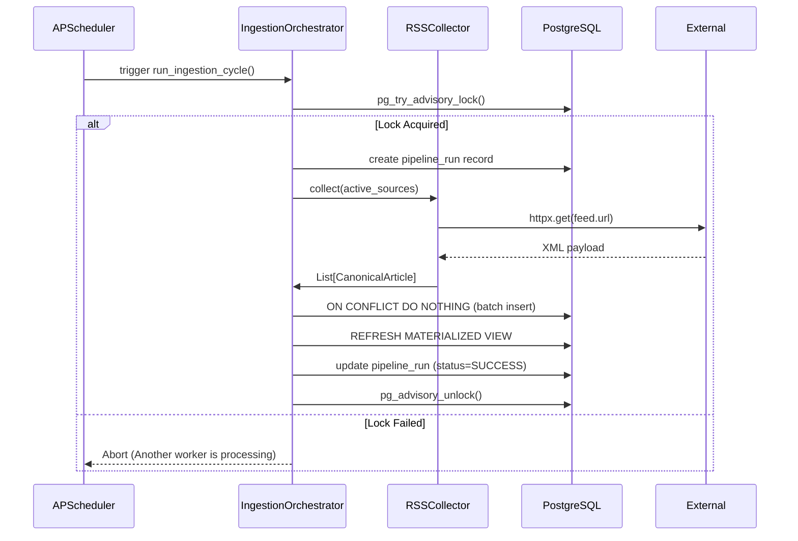
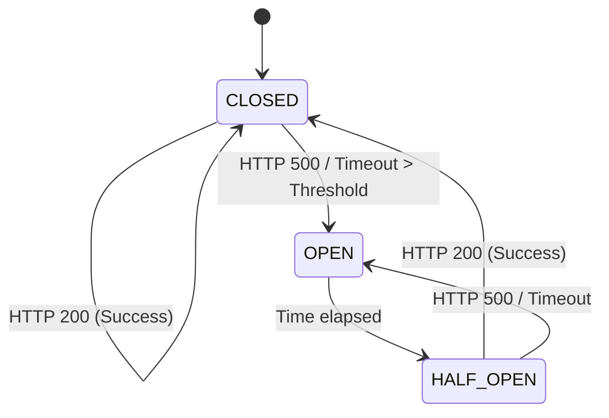

# Architecture Diagrams

## Ingestion Flow



## Enrichment Lifecycle

```mermaid
flowchart TD
    Raw[Raw XML Item] --> Extract[Extract Title/Link/Date]
    Extract --> Canonicalize[Canonicalize URL]
    Canonicalize --> Hash[SHA-256 (Title+Body)]
    Hash --> Enrich[Regex Dictionary Scan]
    Enrich --> Match1{Keyword Match?}
    Match1 -- Yes --> Tag1[Assign Category/Sector]
    Match1 -- No --> Tag2[Assign 'OTHER']
    Enrich --> DB[Insert into articles table]
```

## Resilience Lifecycle (Circuit Breaker)


